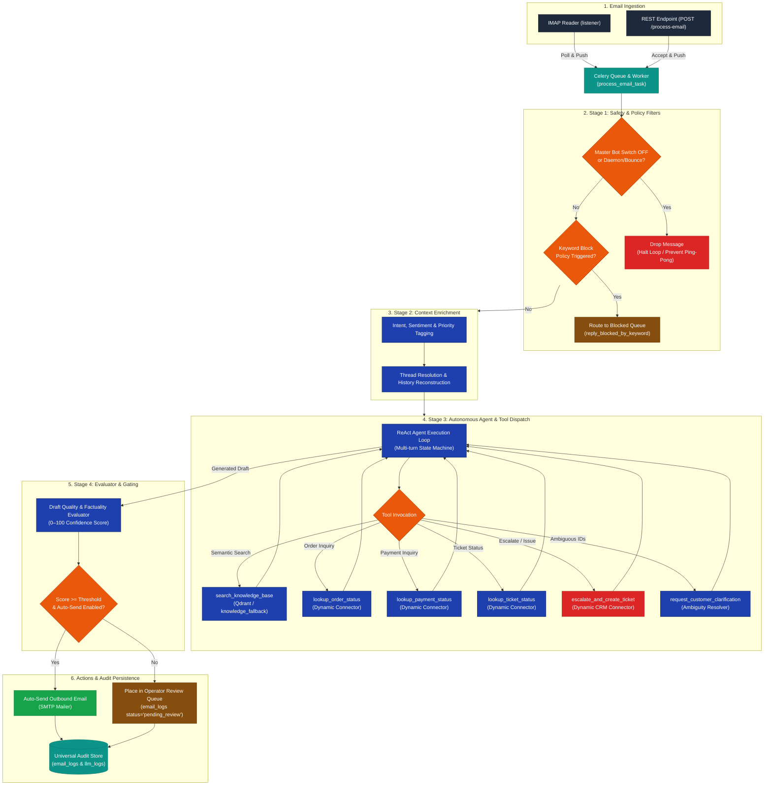

# AI Email Bot Architecture & Execution Lifecycle Specification

This specification documents the email bot's end-to-end operational lifecycle: from ingestion to multi-stage filtering, context enrichment, autonomous agent tool dispatch, quality evaluation, and automated decision-making (auto-send vs. human review vs. CRM ticket escalation).

---

## 1. System Ingestion and Execution Flow



---

## 2. Pipeline Execution Stages

### Stage 1: Safety & Policy Filters (`app/pipeline/filters.py`)
1. **Master Bot Switch**: Tenant-level master kill-switch. When disabled by administrator, automated processing terminates immediately.
2. **Infinite Loop & Ping-Pong Protection**: 
   - Detects delivery failure headers (`Delivery-Status`, `Return-Path: <>`), automated mailer-daemon notifications, and auto-responders.
   - Drops bounce notifications cleanly to eliminate automated ping-pong loops between bots.
3. **Keyword Blocking & Paused Senders**:
   - Compares message sender against active paused customer records. Emails from paused senders route to `paused_email_history`.
   - Scans body and subject against tenant keyword policies (`keyword_block_policy`), dual-writing intercepted mail to `reply_blocked_by_keyword`.

### Stage 2: Context Enrichment (`app/pipeline/enricher.py`)
1. **Intent & Metadata Extraction**:
   - Classifies primary customer intent (`order_inquiry`, `complaint`, `support_request`, `cancellation`, `general_faq`).
   - Assesses sentiment (`positive`, `neutral`, `negative`) and urgency level (`low`, `medium`, `high`, `critical`).
2. **Thread Resolution & RFC-822 Alignment**:
   - Evaluates `Message-ID`, `In-Reply-To`, `References`, and normalized subject headers.
   - Generates normalized thread keys (`th_<hash>`) and pulls prior conversation turns from Redis or SQL audit history.

### Stage 3: Autonomous Agent Loop & Tool Dispatch (`app/pipeline/agent.py`, `app/pipeline/tools.py`)
The system executes an autonomous multi-turn agent with authorized tool dispatch:
- **`search_knowledge_base`**: Executes hybrid semantic retrieval against Qdrant collections. If the vector store is offline, transparently falls back to local JSON stores (`knowledge_fallback/`).
- **`lookup_order_status`**: Queries tenant order APIs via the Dynamic Connector Engine (`app/connector_executor.py`).
- **`lookup_payment_status`**: Fetches gateway transaction status via approved payment connectors.
- **`lookup_ticket_status`**: Resolves existing CRM ticket status and notes.
- **`request_customer_clarification`**: Activated when the customer mentions multiple order/ticket IDs or provides incomplete details, prompting for clarification rather than hallucinating.
- **`escalate_and_create_ticket`**: Formulates a structured CRM ticket creation payload and records the newly minted ticket reference into `ticket_record`.

### Stage 4: Quality Evaluator & Gating (`app/pipeline/evaluator.py`)
1. **Confidence Scoring**: Analyzes the agent's drafted reply against the customer query, customer sentiment, and retrieved context, producing a score from `0` to `100`.
2. **Decision Matrix**:
   - **Auto-Send (`status='sent'`)**: Triggered when `score >= client_threshold` AND the client's `auto_send` feature switch is `True`. The email is dispatched immediately via SMTP.
   - **Human Review (`status='pending_review'`)**: Triggered when `score < client_threshold` OR `auto_send` is disabled. The email and draft are queued in the Operator Live Inbox for approval, editing, or manual reply.
   - **Escalated (`status='ticket_created_and_sent'`)**: When ticket creation succeeded, the formal confirmation containing the ticket number is dispatched to the customer.

---

## 3. Dynamic Connector Engine Specification

Rather than relying on rigid, hardcoded CRM integration scripts, the platform operates a generic, admin-governed connector execution engine (`app/connector_executor.py`).

### 1. Template Structure & Context Data
Connector templates utilize safe `{{placeholder}}` substitutions populated from `CONTEXT_DATA_KEYS`:
```
client_id, from_email, subject, body, cleaned_body, ticket_id,
intent, sentiment, priority, customer_name, history_summary, issue_description
```
Placeholders are JSON-escaped prior to substitution to prevent structure injection.

### 2. Request Dispatch
- **HTTP Methods**: `POST` (JSON body) or `GET` (query parameters).
- **Authentication Types**:
  - `bearer`: Injects `Authorization: Bearer <token>`.
  - `basic`: Injects HTTP Basic Auth credentials from decrypted JSON secrets.
  - `api_key_header`: Injects a custom header specified by `auth_field_name`.
  - `api_key_query`: Appends a query parameter specified by `auth_field_name`.
- **SSRF Allowlist Enforcement**: URLs must strictly match admin-approved domains in `url_allowlist` (checked both at configuration approval and during runtime execution).

### 3. Response Extraction (JMESPath)
Responses are parsed dynamically using JMESPath path expressions with optional regex extraction:
```json
{
  "fields": [
    {
      "field": "ticket_id",
      "path": "Response.Ticket.ID",
      "extract_regex": "T-\\d{6}-\\d+"
    },
    {
      "field": "ticket_status",
      "path": "Response.Ticket.Status"
    }
  ]
}
```

---

## 4. Resilience & Operational Guardrails

1. **Vector Store Resilience**: Qdrant vector retrieval failures automatically degrade to the `knowledge_fallback/` directory without disrupting customer responses.
2. **LLM Circuit Breakers (`app/llm_circuit_breaker.py`)**: Individual provider outages (e.g. Groq 503 or OpenAI rate limits) automatically trip circuit breakers with exponential cooldown, triggering failover to secondary configured models.
3. **Outbox Idempotency (`app/action_outbox.py`)**: Critical side-effects (ticket creation, external webhooks) require idempotency keys in Redis/MySQL. Duplicate tasks within 60 seconds are deduplicated safely.
4. **Poison Pill Elimination (`worker/tasks.py`)**: Malformed emails that cause unhandled worker exceptions are retry-limited (max 2 retries) before being dead-lettered with `status='failed'`, protecting the worker pool from starvation.
