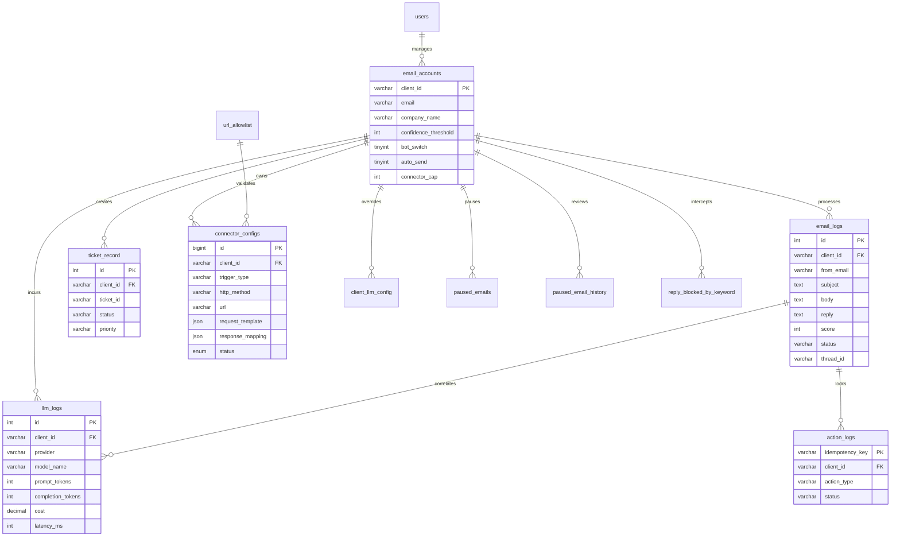

# Database Schema & Entity-Relationship Reference

This document provides the authoritative data dictionary and entity-relationship model for the Mail AI Automation relational storage (MySQL 8.0).

---

## 1. Entity-Relationship Overview

---

## 2. Core Operational Tables

### `email_accounts` (Tenants & Monitored Mailboxes)
The root multi-tenant account record defining customer identity, inbox polling credentials, and automation policy gates.

| Column | Type | Constraints | Description |
|---|---|---|---|
| `client_id` | `VARCHAR(50)` | `PRIMARY KEY` | Unique tenant identifier (e.g. `CLI-4159FFCF`). |
| `email` | `VARCHAR(255)` | `NOT NULL` | IMAP/SMTP monitored email address. |
| `password` | `VARCHAR(255)` | `NOT NULL` | Encrypted IMAP mailbox password / app password. |
| `company_name` | `VARCHAR(255)` | `NULL` | Business display name used in AI reply signatures. |
| `department` | `VARCHAR(100)` | `NULL` | Assigned operational department. |
| `confidence_threshold` | `INT` | `DEFAULT 75` | Minimum evaluation score (0–100) required to auto-send replies. |
| `reply_tone` | `VARCHAR(50)` | `DEFAULT 'Professional'` | Persona instruction (`Professional`, `Friendly`, `Direct`). |
| `bot_switch` | `TINYINT(1)` | `DEFAULT 1` | Master bot killswitch (0 = completely disabled). |
| `auto_send` | `TINYINT(1)` | `DEFAULT 1` | Auto-dispatch gate (0 = always hold for human review). |
| `connector_cap` | `INT` | `DEFAULT 5` | Maximum allowed `live` or `pending_approval` dynamic connectors. |

---

### `email_logs` (Universal Inbound & Execution Audit Store)
The primary audit log storing every received email, classification metadata, drafted responses, and resolution outcomes.

| Column | Type | Indexing | Description |
|---|---|---|---|
| `id` | `INT` | `AUTO_INCREMENT PK` | Unique audit record ID. |
| `client_id` | `VARCHAR(50)` | `INDEX` | Owning tenant identifier. |
| `from_email` | `VARCHAR(255)` | `INDEX` | Customer sender address. |
| `subject` | `TEXT` | — | Raw email subject line. |
| `body` | `TEXT` | — | Plaintext email body. |
| `body_html` | `LONGTEXT` | — | Original HTML email structure (for rich rendering). |
| `reply` | `TEXT` | — | Generated or operator-approved response text. |
| `score` | `INT` | — | Quality evaluation confidence score (0–100). |
| `status` | `VARCHAR(50)` | `INDEX` | Lifecycle status (`new`, `sent`, `pending_review`, `ticket_created_and_sent`, `failed`). |
| `sentiment` | `VARCHAR(50)` | — | Extracted sentiment (`Positive`, `Neutral`, `Negative`). |
| `priority` | `VARCHAR(50)` | — | Extracted urgency (`Low`, `Medium`, `High`, `Critical`). |
| `thread_id` | `VARCHAR(100)` | `INDEX` | Normalized conversation thread key (`th_<hash>`). |
| `message_id` | `VARCHAR(255)` | `INDEX` | RFC-822 Message-ID header for duplicate suppression. |
| `is_resolved` | `TINYINT(1)` | `DEFAULT 0` | Flagged true when customer confirms issue resolution. |
| `troubleshooting_step` | `INT` | `DEFAULT 0` | Turn count within active multi-turn diagnostic loop. |

---

### `ticket_record` (Escalated CRM Tickets)
Tracks support tickets created in external CRM/ERP platforms by the autonomous agent or operator actions.

| Column | Type | Description |
|---|---|---|
| `id` | `INT` | Primary Key. |
| `client_id` | `VARCHAR(50)` | Owning tenant identifier. |
| `ticket_id` | `VARCHAR(100)` | External CRM ticket reference (e.g. `T-260526-00431`). |
| `email` | `VARCHAR(255)` | Customer email associated with ticket. |
| `status` | `VARCHAR(50)` | CRM status (`Open`, `Under Investigation`, `Resolved`). |
| `priority` | `VARCHAR(50)` | Ticket priority (`Low`, `Medium`, `High`, `Urgent`). |
| `created_at` | `TIMESTAMP` | Ticket creation timestamp. |

---

## 3. Dynamic Connector & SSRF Governance Tables

### `connector_configs` (API Integration Templates)
Governs external CRM, ERP, and payment API integrations without hardcoded Python scripts.

| Column | Type | Modifiers | Description |
|---|---|---|---|
| `id` | `BIGINT` | `AUTO_INCREMENT PK` | Configuration revision ID. |
| `client_id` | `VARCHAR(50)` | `NOT NULL` | Target tenant identifier. |
| `trigger_type` | `VARCHAR(100)` | `NOT NULL` | Routing key (`order_status`, `ticket_create`, `payment_status`). |
| `http_method` | `VARCHAR(10)` | `NOT NULL` | HTTP verb (`GET` or `POST`). |
| `url` | `VARCHAR(500)` | `NOT NULL` | Target endpoint (must match `url_allowlist`). |
| `headers_template` | `JSON` | `NULL` | Header key-value template with `{{placeholder}}` substitutions. |
| `request_template` | `JSON` | `NULL` | Payload template populated from `CONTEXT_DATA_KEYS`. |
| `response_mapping` | `JSON` | `NOT NULL` | JMESPath extraction paths for required fields. |
| `auth_type` | `ENUM` | `NOT NULL` | `bearer`, `basic`, `api_key_header`, `api_key_query`. |
| `auth_secret_encrypted` | `TEXT` | `NULL` | Fernet-encrypted authentication secret. |
| `status` | `ENUM` | `NOT NULL` | `draft`, `pending_approval`, `live`, `disabled`. |
| `live_marker` | `VARCHAR(100)` | `GENERATED` | `trigger_type` if `live`, else `NULL` (enforces single live row). |
| `pending_marker` | `VARCHAR(100)` | `GENERATED` | `trigger_type` if `pending_approval`, else `NULL`. |

---

### `url_allowlist` (SSRF Defense Barrier)
Curated allowlist of domains and endpoints permitted as connector targets.

| Column | Type | Modifiers | Description |
|---|---|---|---|
| `id` | `BIGINT` | `AUTO_INCREMENT PK` | Allowlist entry ID. |
| `scheme` | `VARCHAR(20)` | `NOT NULL` | Protocol (`https` or `http`). |
| `netloc` | `VARCHAR(255)` | `NOT NULL` | Hostname and optional port (`api.zoho.com`). |
| `path` | `VARCHAR(255)` | `DEFAULT ''` | Permitted URL prefix. Prefix-indexed `path(191)` to prevent MySQL 3072-byte key overflow. |

---

## 4. Operational Queues & Safeguard Tables

### `action_logs` (Outbox Idempotency Barrier)
Prevents duplicate ticket creations or external side-effects when Celery worker tasks retry after transient network errors.

| Column | Type | Description |
|---|---|---|
| `idempotency_key` | `VARCHAR(255) PK` | SHA256 hash of `(client_id, action_type, context_digest)`. |
| `status` | `VARCHAR(20)` | `pending`, `completed`, `failed`. |
| `external_ref` | `VARCHAR(255)` | Stored return reference (e.g. ticket ID) reused on retry. |

---

### `paused_email_history` & `reply_blocked_by_keyword`
Actionable operator review queues for emails diverted from the autonomous pipeline.

- `paused_email_history`: Stores messages arriving from customers whose senders are paused via `paused_emails`. Statuses: `pending_review`, `ignored`, `replied`.
- `reply_blocked_by_keyword`: Stores messages intercepted by tenant rules defined in `keyword_block_policy`.

---

## 5. Telemetry & Cost Accounting

### `llm_logs` (Granular Token Ledger)
Records token consumption, latency, and cost for every LLM invocation across providers.

| Column | Type | Description |
|---|---|---|
| `id` | `INT PK` | Auto-increment ID. |
| `client_id` | `VARCHAR(50)` | Tenant incurring the expense. |
| `provider` | `VARCHAR(50)` | LLM provider (`groq`, `openai`, `anthropic`, `gemini`). |
| `model_name` | `VARCHAR(100)` | Target model (e.g. `llama-3.3-70b-versatile`, `gpt-4o`). |
| `prompt_tokens` | `INT` | Input prompt token count. |
| `completion_tokens` | `INT` | Output generation token count. |
| `cost` | `DECIMAL(10, 6)` | Calculated actual API cost based on pricing matrix. |
| `latency_ms` | `INT` | Execution latency in milliseconds. |
| `caller_function` | `VARCHAR(100)` | Calling agent function (`classify_intent`, `agent_react_turn`, `evaluate_score`). |
