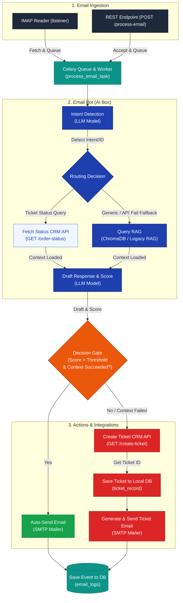

# AI Email Bot Architecture Specification

This specification documents the email bot's operational lifecycle: from ingestion to intent-based routing, LLM drafting, quality scoring, and automated decision-making (auto-reply vs. escalating to CRM Ticket Creation).

---

## 1. System Ingestion and Routing Flow



---

## 2. Dynamic Decision Matrix

The system processes each email using an asynchronous Celery task (`process_email_task`) and makes a routing decision using the following logic:

### Score Scoring
1. **Quality Evaluator (`llm_score`):** Once a draft reply is formulated, an LLM evaluates the drafted response against the customer's query, outputting a quality score between `0` and `100`.
2. **Client Threshold (`get_email_score_threshold`):** The system dynamically fetches the pre-configured threshold percentage of the client from the database (e.g., `80%`).

### Routing Decision Logic
* **Path A: Auto-Send (High Confidence)**
  * **Condition:** `score > threshold` (strictly greater) **AND** context retrieval was successful.
  * **Action:** The system sends the drafted response directly to the customer's email via SMTP and updates `email_logs.status = "sent"`.
* **Path B: Escalation / Create CRM Ticket (Low Confidence or Missing Context)**
  * **Condition:** `score <= threshold` **OR** `context_failed == True` (known as **Hard Floor Trigger**).
  * **Action:**
    1. System calls the **CRM Create Ticket Webhook**.
    2. Receives a CRM ticket ID (e.g. `T-260526-00045`) from the response.
    3. Saves the record to local `ticket_record` SQL database for UI tracking.
    4. Composes a formal ticket-created reply (containing the Ticket ID, status, priority, and remarks).
    5. Sends this formatted email notification to the customer.
    6. Updates `email_logs.status = "ticket_created_and_sent"`.

---

## 3. Webhook and API Call Specifications

The email bot integrates with external CRM systems (such as C-Zentrix CRM) via base64 encoded URL parameters over HTTP GET requests.

### A. CRM Create Ticket Webhook (Escalation)

* **HTTP Method:** `GET`
* **Target URL:** Configured per client in database (`db_create_payload_table["url"]`).
* **Query Parameter:** `?data=<Base64_Encoded_JSON_Payload>`

#### 1. JSON Payload Structure (Before Encoding)
```json
{
  "mail_id": "customer@example.com",
  "subject": "Unable to check order status",
  "body": "Hi, I have been trying to track order ORD10294 but your website displays an error. Please help.",
  "status": "Ticket_Generated",
  "additional_meta_1": "client_val_1"
}
```
*The `status` is hardcoded to `"Ticket_Generated"`. The other client-specific keys are pre-loaded from the client's db config, and actual email fields are dynamically injected.*

#### 2. Base64 URL Request Formulation
The JSON string is encoded using base64 and appended to the URL:
```python
json_str = json.dumps(payload)
encoded_data = base64.b64encode(json_str.encode()).decode()
request_url = f"{api_url}?data={encoded_data}"
```

#### 3. Expected Success Response JSON
```json
{
  "Status": "Success",
  "Message": "Ticket generated successfully. Refrence_No is T-260526-00431",
  "Refrence_No": "T-260526-00431"
}
```
*The Celery worker uses a regex (`T-\d{6}-\d+`) on `Refrence_No` or `Message` to parse the newly created Ticket ID.*

---

### B. CRM Fetch Ticket Status API (Intent-based Query)

* **HTTP Method:** `GET`
* **Target URL:** Configured per client in database (`get_payload_get_ticket_table["url"]`).
* **Query Parameter:** `?postData=<Base64_Encoded_JSON_Payload>`

#### 1. JSON Payload Structure (Before Encoding)
```json
{
  "filter": {
    "docket_no": "ORD10294"
  },
  "additional_meta_1": "client_val_1"
}
```
*The parsed ticket/order ID is dynamically injected under `filter.docket_no`.*

#### 2. Expected Success Response JSON
```json
{
  "Success": {
    "ticket_1": {
      "docket_no": "T-260526-00431",
      "ticket_status": "Under Investigation",
      "priority_name": "High",
      "ticket_type": "Billing Inquiry",
      "problem_reported": "Order status page error",
      "agent_remarks": "Escalated to logistics team.",
      "disposition_name": "In Process",
      "sub_disposition_name": "Awaiting Vendor Response",
      "assigned_to_dept_name": "Support Dept",
      "assigned_to_user_name": "Support Agent",
      "person": {
        "person_name": "John Doe",
        "person_mail": "customer@example.com",
        "mobile_no": "9999988888"
      }
    }
  }
}
```

---

## 4. How to Generate the PDF Specification

A custom script has been created in the root of the workspace to compile this specification and vector-drawn state machine diagram into a premium, professional PDF report named `Email_Bot_Architecture.pdf`.

To generate this PDF, execute the following command in the workspace directory:

```bash
python generate_flow_pdf.py
```

### Dependencies
The script will automatically detect and install `reportlab` if it is missing from the environment:
* **ReportLab:** Standard python library used for building beautiful vector graphics and structured PDF documents.
